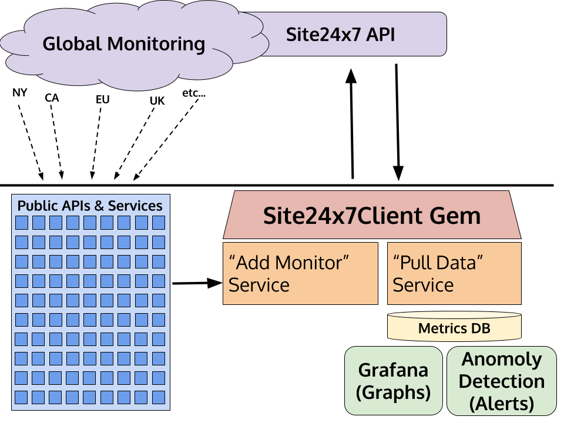

# Site24x7client

Site24x7client is an un-official [Site24x7](https://www.site24x7.com/) [API](https://www.site24x7.com/api/) Ruby client. It supports many of the major features of the API with a simple Ruby interface (for API v2).  You can set up monitors, add users, and retrieve status data easily.  <br>

Note: this is v0.1.0, there are _many_ basic features left to complete (comprehensive tests, summary reports, easy to use thresholds, etc.).  Accepting PRs for needed functionality! <br>

Important: Thanks to [DigitalOcean](https://www.digitalocean.com/)'s [DropletKit](https://github.com/digitalocean/droplet_kit) and [ResourceKit](https://github.com/digitalocean/resource_kit), as much was borrowed re: API client style. <br>

<!--[](https://travis-ci.org/REPO-ORG/site24x7client)
-->
## Installation

Add this line to your application's Gemfile:

    gem 'site24x7client'

And then execute:

    $ bundle install

Or install it as:

    $ gem install site24x7client
    
**Ruby version note:** Site24x7client was tested on v2.4, but you should be able to use various 2.0+ flavors without much difficulty. <br>

## Usage

Of course you'll need a Site24x7 Account to get started (they offer free ones), and then generate an access token: [https://www.site24x7.com/app/client#/admin/developer/api](https://www.site24x7.com/app/client#/admin/developer/api)

	$ export SITE24X7_TOKEN=*TOKEN_HERE*

**To start, retrieve a client instance with your access token:**

```ruby
require 'site24x7client'
client = Site24x7client::Client.new(access_token: ENV["SITE24X7_TOKEN"])
```
To perform a GET request to list particular resources, try the following:

```
monitors              = client.monitors.all
monitor_groups        = client.monitor_groups.all
user_groups           = client.user_groups.all
users                 = client.users.all
location_profiles     = client.location_profiles.all
threshold_profiles    = client.threshold_profiles.all
notification_profiles = client.notification_profiles.all
```
To find a specific monitor by id or name:

```
client.monitors.find(id: "12345678901234567890")
client.monitors.find_by_name(name: "Name-Here")
```
Note: when using `find_by_name` you must use `%20` as a substitute for spaces as this name will become part of the URL request: 
```
client.monitors.find_by_name(name: 	"If%20There%20Are%20Spaces")
```

To pull up-to-date location data on monitor statuses, and then to parse specifically by location of Website Monitors, i.e. type: "URL"

```
current_status = client.current_status.all
current_status.url_locations
```

## Development
To experiment with the code, run `bundle console` for an interactive prompt. <br>

It should allow you to run an interactive REPL session to test out gem functionality.

In an ideal world there would be lots of info about tests here as well :(

<!-- ADD TESTING INFO HERE
After checking out the repo, run `bin/setup` to install dependencies. Then, run `rake test` to run the tests. You can also run `bin/console` for an interactive prompt that will allow you to experiment.

To install this gem onto your local machine, run `bundle exec rake install`. To release a new version, update the version number in `version.rb`, and then run `bundle exec rake release`, which will create a git tag for the version, push git commits and tags, and push the `.gem` file to [rubygems.org](https://rubygems.org).
-->

## Architecture

This describes how the **Site24x7client gem** could interact with a larger system architecture.  Having easy-to-use access to the Site24x7 API can quickly allow you to create services that pull data for metrics or add new monitors as they go live.



## Gem Design
Site24x7client follows a strict design pattern of resources as methods on the client.  For example, call the client and then its method/resource:

```
client = Site24x7client::Client.new(access_token: 'YOUR_TOKEN')
client.monitors #=> MonitorsResource
```

Site24x7client will return Ruby objects that contain the information provided by the API. For example:

```
client = Site24x7client::Client.new(access_token: 'YOUR_TOKEN')
client.monitors.all
# => [ Site24x7client::Monitor(id: 123, display_name: 'example.com', ...), 
Site24x7client::Monitor(id: 456, name: 'test.com', ...) ]
```

In _most_ cases this is true, say for create or update, POST/PUT, but for others, a response of TRUE upon success may be default.
<br><br>
To save objects, instantiate the object and persist it using the resource objects. As an example:

```
client = Site24x7client::Client.new(access_token: 'YOUR_TOKEN')
monitor = Site24x7client::Monitor.new(display_name: "NYC-example.com", type: "URL", website: "https://example.com", etc...)
created = client.monitors.create(monitor)
# => Site24x7client::Monitor(id: 1231, display_name: 'NYC-example.com', ...)
```

To retrieve objects, you can perform this type of action on the resource (if the API supports it):

```ruby
client = Site24x7client::Client.new(access_token: 'YOUR_TOKEN')
monitor = client.monitors.find(id: 123)
# => Site24x7client::Monitor(id: 1231, display_name: 'NYC-example.com', ...)
```
### Template for creating Monitor.new

```
monitor = Site24x7client::Monitor.new({
	"monitor_id": "",
	"display_name": "this is a new monitor",
	"type": "URL",
	"website": "http//www.example.com",
	"check_frequency": 1,
	"timeout": 10,
	"location_profile_id": "need-valid-id",
	"notification_profile_id": "need-valid-id",
	"threshold_profile_id": "need-valid-id",
	"user_group_ids": ["need-valid-id"],
	"http_method": "G",
	"use_ipv6": false,
	"matching_keyword": {
		"value": "",
		"severity": 0
	},
	"monitor_groups": ["need-valid-id"],
	"up_status_codes": "200"
})
```

### Template for creating User.new
```
user = Site24x7client::User.new(
{
	"display_name": "NAME_HERE",
	"email_address": "name@example.com",
	"user_role": 1,
	"notify_medium": [1],
	"user_groups": ["GROUP_ID1", "GROUP_ID2"],
	"alert_settings": {
		"email_format": 0,
		"dont_alert_on_days": [0, 1, 2, 3, 4, 5, 6],
		"down": [1],
		"trouble": [1],
		"up": [1]
	}
})
```

# List of all Resources and Actions
**Instantiate the client:**

```
client = Site24x7client::Client.new(access_token: 'TOKEN')
```

## Monitor resource
Actions supported:

* `client.monitors.all`
* `client.monitors.find(id: "id")`
* `client.monitors.find_by_name(name: "name")`
* `client.monitors.create(Monitor.new(params))`
* `client.monitors.update(Monitor, id: "id")`
* `client.monitors.delete(id: "id")`
* `client.monitors.delete_by_name(name: "name")`
* `client.monitors.delete_multiple(monitor_ids: "monitor_id,monitor_id")`
* `client.monitors.activate(id: "id")`
* `client.monitors.suspend(id: "id")`

## User resource
Actions supported:

* `client.users.all`
* `client.users.find(id: "id")`
* `client.users.create(User.new(params))`
* `client.users.update(User, id: "id")`
* `client.users.delete(id: "id")`

## Current Status resource
Actions supported:

* `client.current_status.all`
* `client.current_status.find(id: "id")`

All the methods for querying current status by Monitor Type are supported. For more info see "Types" on Site24x7's [constants](https://www.site24x7.com/help/api/#constants).  
A few examples though:

* `client.current_status.urls`
* `client.current_status.homepages`
* `client.current_status.realbrowsers`

These are parsing methods after getting all monitor_statuses:

* `current_status   = client.current_status.all`
* `current_status.web`
* `current_status.url`
* `current_status.url_locations`
* `current_status.advanced`
* `current_status.to_groups`
* `current_status.groups`
* `current_status.group_locations`
* `current_status.all_monitors`
* `current_status.all_locations`

## Location Profile resource
Actions supported:

* `client.location_profiles.all `
* `client.location_profiles.find(id: "id")`
* `client.location_profiles.create(LocationProfile.new(params))`
* `client.location_profiles.update(LocationProfile, id: "id")`
* `client.location_profiles.delete(id: "id")`


## Notification Profile resource
Actions supported:

* `client.notification_profiles.all`
* `client.notification_profiles.find(id: "id")`
* `client.notification_profiles.create(NotificationProfile.new(params))`
* `client.notification_profiles.update(NotificationProfile, id: "id")`
* `client.notification_profiles.delete(id: "id")`

## Threshold Profile resource
Actions supported:

* `client.threshold_profiles.all`
* `client.threshold_profiles.find(id: "id")`
* `client.threshold_profiles.create(ThresholdProfile.new(params))`
* `client.threshold_profiles.update(ThresholdProfile, id: "id")`
* `client.threshold_profiles.delete(id: "id")`

## Monitor Group resource
Actions supported:

* `client.monitor_groups.all`
* `client.monitor_groups.find(id: "id")`
* `client.monitor_groups.create(MonitorGroup.new(params))`
* `client.monitor_groups.update(MonitorGroup, id: "id")`
* `client.monitor_groups.delete(id: "id")`

## User Group resource
Actions supported:

* `client.user_groups.all`
* `client.user_groups.find(id: "id")`
* `client.user_groups.create(UserGroup.new(params))`
* `client.user_groups.update(UserGroup, id: "id")`
* `client.user_groups.delete(id: "id")`

## Audit Log resource
Actions supported:

* `c.audit_logs.all(params: Site24x7client::AuditLog.one_hour_ago)`
* `c.audit_logs.all(params: Site24x7client::AuditLog.one_week_ago)`
* `c.audit_logs.all(params: Site24x7client::AuditLog.one_month_ago)`
* `c.audit_logs.all(params: Site24x7client::AuditLog.one_year_ago)`


## Contributing

Bug reports and pull requests are welcome! <br>

1. Fork it [https://github.com/danvideo/site24x7client/fork]()
2. Create your feature branch `git checkout -b my-new-feature`
3. Commit your changes `git commit -am 'Add some feature'`
4. Push to the branch `git push origin my-new-feature`
5. Create a new Pull Request

## License

The gem is available as open source under the terms of the [MIT License](http://opensource.org/licenses/MIT).
